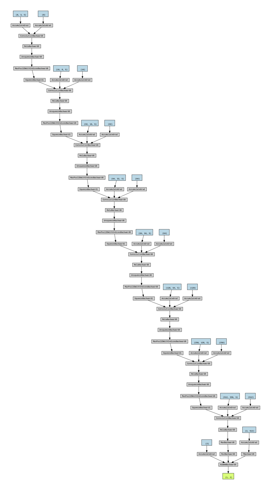

# Neural network directory, CNN architecture

_Used Network architextures are found in neural.py. The final network we used in the research is Net5()_

The CNN structure is visualized in the following figure: 

 
 

The network uses multiple 1D convolutional layers. This allows it to explore different, and more abstract, features of the signals in order to distinguish them from the noise. Our code is mainly a sequence of the following pattern: 

[+] Convolutional 1D layer
[+] Relu activation function
[+] MaxPooling

As described in Section \ref{sec:Data} every sample has 3 input channels. 

Therefore, the structure of the network begins with a convolutional layer, which has 3 input channels, 8 outputs, and a kernel size of 5. This can be mathematically represented by: 

$$y_{i,j} = \sum_{k=0}^{K-1} W_{k,i,j} * x_{i+k}+b_j,$$

where $i$ is the index of the element in the output signal, $j$ is the index of the output channel, $k$ is the index of the element in the kernel. Moreover, $x$, $W$, and $b$ represent the input signal, kernel, and bias term, respectively. Then, this is followed by a ReLU activation function. Subsequently, a max pooling layer with a kernel size of 2 is employed. This operation down-samples the input by taking the maximum value over a 2-element window, which in practice halves the dimension of the data strain.

This process (Convolution,Relu,MaxPooling) is repeated 8 times, with the number of channels in the output progressively increasing (3, 8, 16, 32, 64, 64, 128, 256, 512), this allows exploring more features of the data in order to distinguish a signal from the noise.
After the last convolution, we are left with 512 channels and 512 features (65,536 input features divided by $2^7$ MaxPooling). This is then pushed through a final Maxpooling, but now over the whole 512 features to end up with a 512x1 dimensional layer. Then, it follows a dropout layer with a dropout rate of $0.5$, which randomly sets a fraction of output units to zero during each forward pass. This is a regularization technique to prevent over-fitting. The last layer is a linear classifier layer reducing the features from 512  to 2 outputs (Injection or Background). Finally, we use the Adam optimizer for these operations. This optimizer provides a good method to update the kernel weights and minimize the loss, which is calculated according to the CrossEntropy function.

